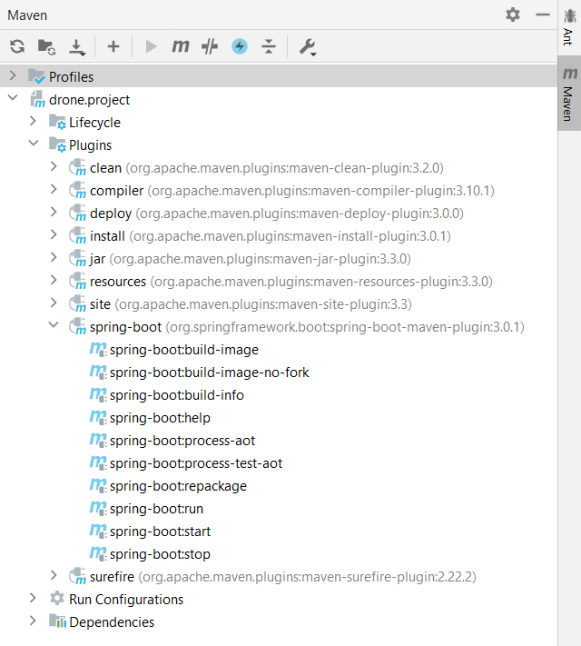
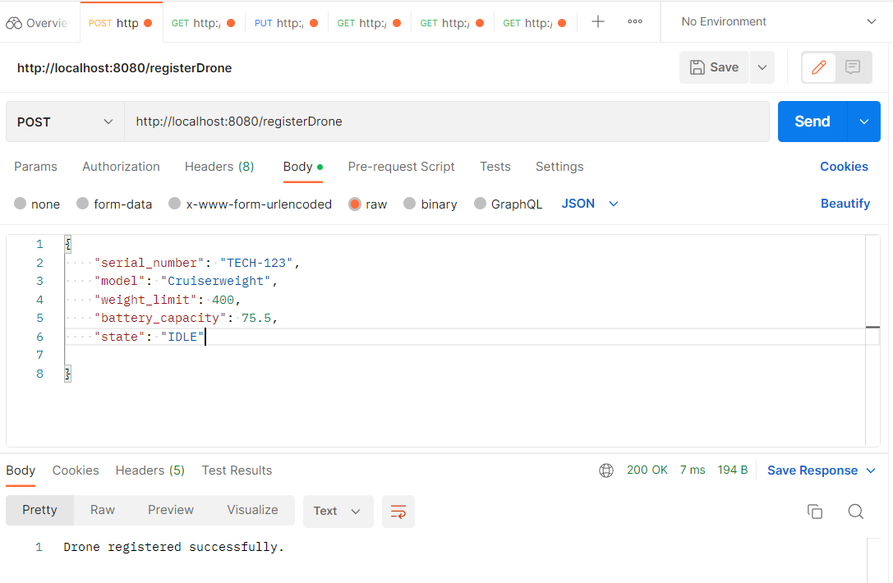

# Drone Application

#### Technologies Used
- Java
- Spring Boot
- Maven
- Rest API
- JPA
- H2(In memory Database)

#### Prerequisite:
- Java 19
- Intellij or Eclipse IDE
- PostMan (for testing API)

#### Build
- Clone the git repo https://github.com/rubika011/Drone_Application.git
- Import the project in IDE and Run the spring boot application(double-click spring-boot:run)

#### Test API calls

##### 1.Registering a drone
    
- URL: http://localhost:8080/registerDrone
- Sample data:
{
    "serial_number": "TECH-123",
    "model": "CruiserWeight",
    "weight_limit": 400,
    "battery_capacity": 75.5,
    "state": "IDLE"
}

##### 2.Loading a drone with medication items

